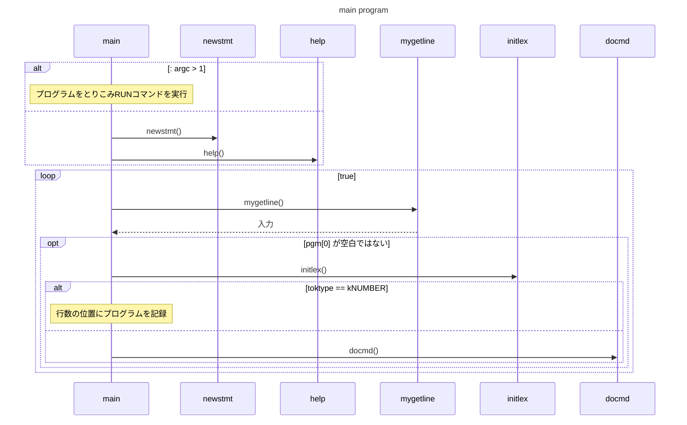
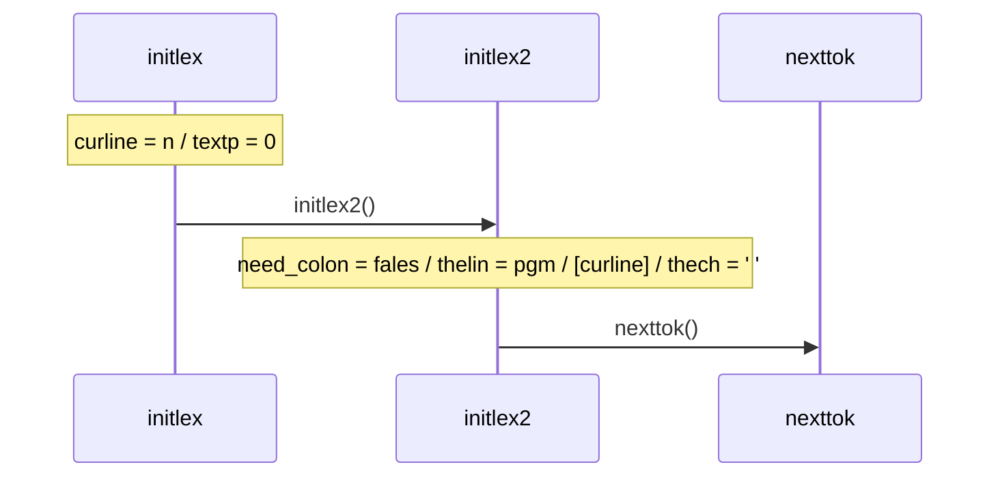
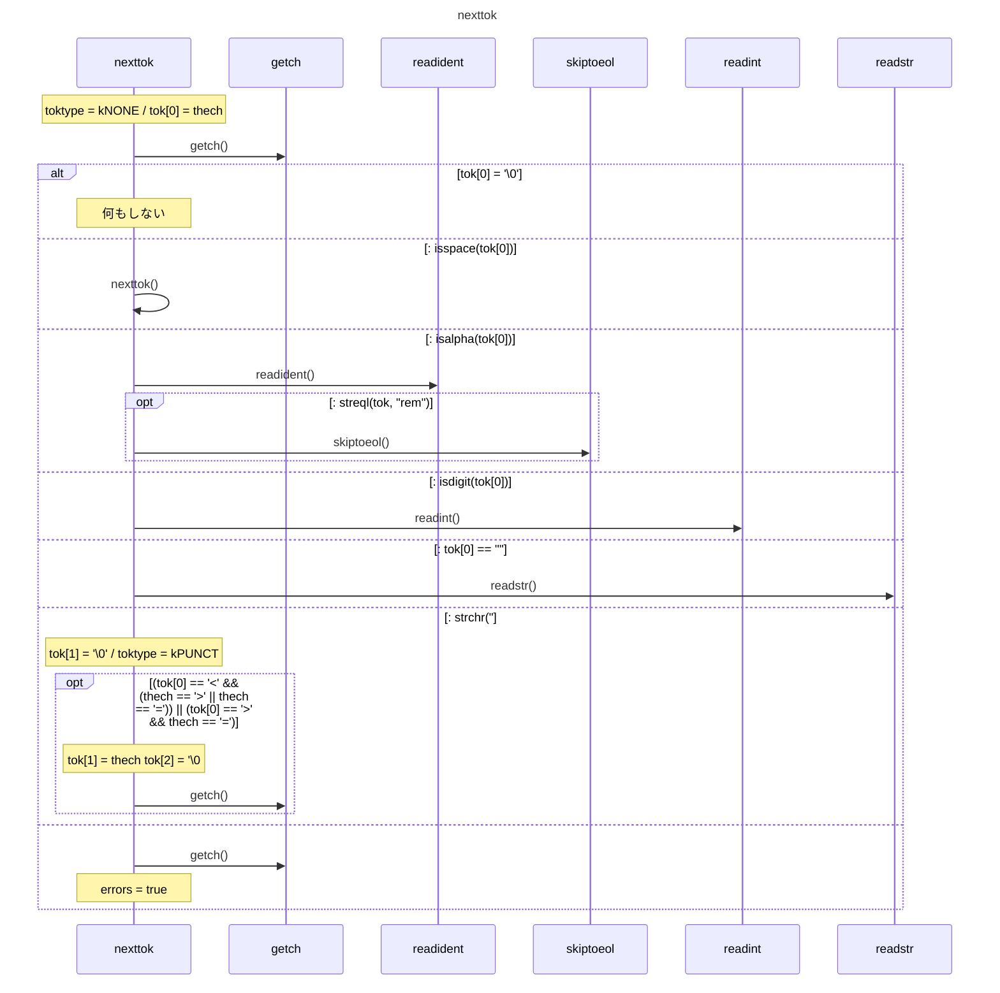
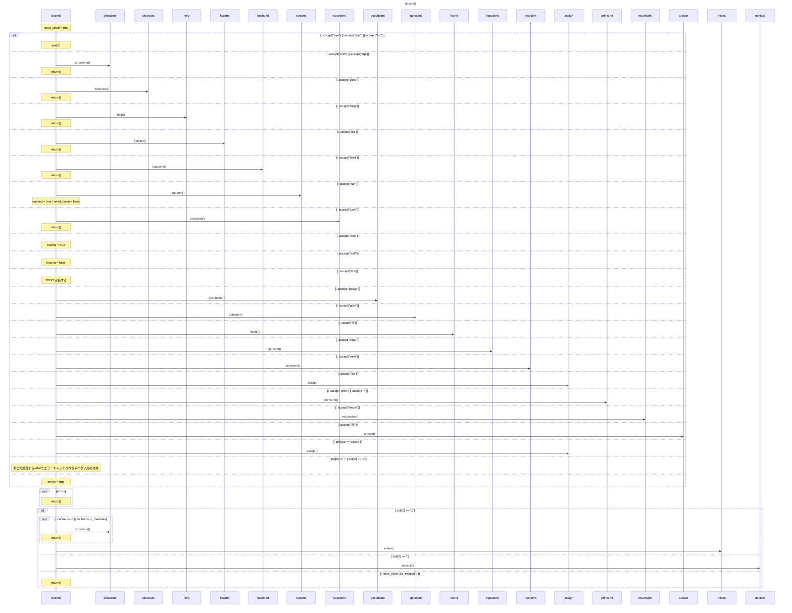

* getch => thechとtextpを更新する
* readxxx() => tokとtoktypeを設定
* skiptoeol() => 終端までスキップ(toktype=kNONE)

* accept => 期待した文字が来ていればnexttok()
* showtime => 時刻を表示
* help => help
* clearvars => 変数を初期化
* liststmt => プログラム全文を表示
